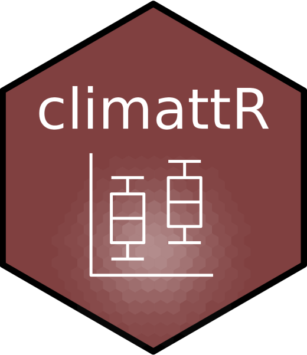
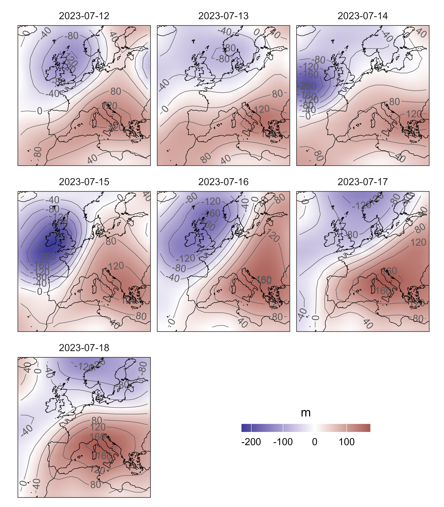
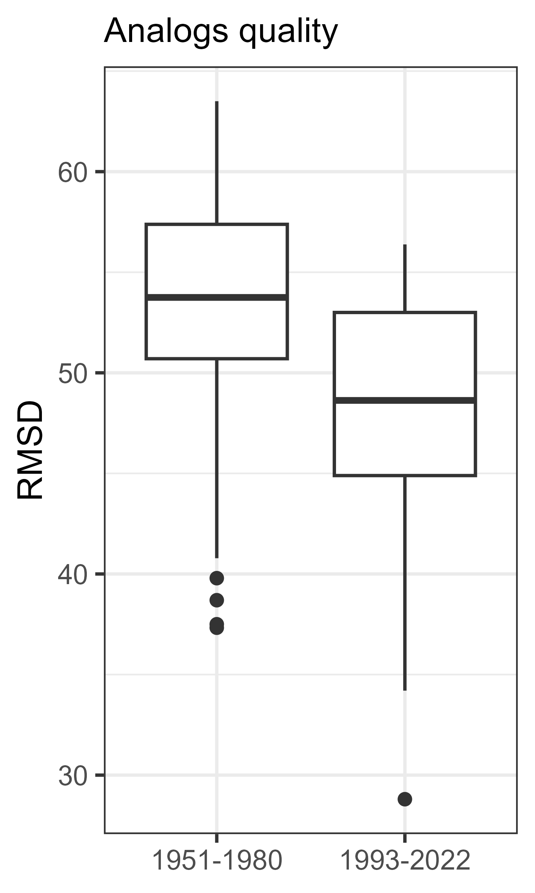
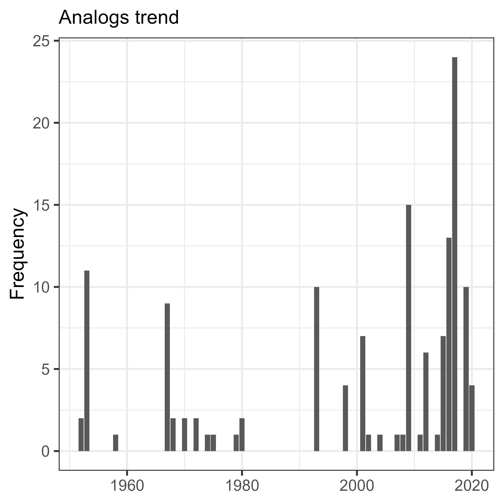
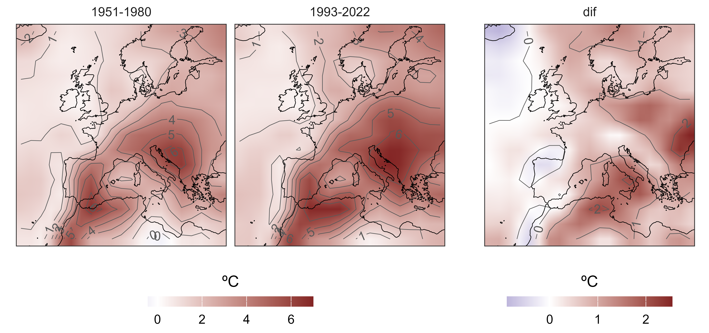

# climattR 

# `climattR`: Rapid climate extreme event attribution for regional and local areas

[](https://cran.r-project.org/package=climattR) [](http://www.repostatus.org/#wip)

## Overview

**climattR** is a toolbox for performing rapid attribution of extreme weather events using the flow analogs approach. *This package is still under developement*

------------------------------------------------------------------------

Contents:

-   [Why this package](#why-this-package)
-   [How it works](#how-it-works)
    -   [Installation](#installation)
-   [Package citation](#package-citation)
-   [Contact](#contact)

------------------------------------------------------------------------

## Why this package {#why-this-package}

To date there is no R package available which have implemented the simple but effective flow analogues methodology to perform extreme weather event attribution. `climattR` contains a set of functions to 1) prepare data to employ flow analogues; 2) Find flow analogue days to a target date; 3) Reconstruct surface fields for extreme weather events in past and present (also future) climate conditions;

## How it works {#how-it-works}

### Installation {#installation}

```{r}
# To install the latest version from Github:
# install.packages("remotes")
# remotes::install_github("lemuscanovas/climattR")

library(climattR)
```

### First steps. Rapid attribution of

Additional libraries

``` r
library(terra)
library(tidyterra)
library(tidyverse)
library(patchwork)
library(giscoR)

borders <- gisco_get_coastallines()
```

``` r
# Loading daily Z500 and t2m data for 1950-2023 summers

Z500 <- rast("inst/testdata/z500_0509_1950_2023_eu.nc")
tasmean <- rast("inst/testdata/tasmean_0509_1950_2023_eu.nc")-273.15
```

``` r
## Preparing data for analogs
dates <- seq(as_date("2023-07-12"), as_date("2023-07-18"),"day")

prepared_data <- prepare_data(x = Z500,
                       level = NULL, # the pressure level is already selected
                       event_dates =  dates,
                       time_window = 31)

extent <- ext(prepared_data$event)                
ggplot() +
  geom_spatraster(data = prepared_data$event - app(prepared_data$ts_wo_event, "mean"),
                  interpolate = T) +
  geom_spatraster_contour_text(data = prepared_data$event - app(prepared_data$ts_wo_event, "mean"),
                          breaks = seq(-200, 200, 40)) +
  geom_sf(data = borders, fill = "transparent", color = "black")+
  facet_wrap(~lyr, ncol = 3) +
  metR::scale_fill_divergent("m")+
  guides(fill = guide_colourbar(theme = theme(
         legend.key.width  = unit(8, "lines"),
         legend.key.height = unit(0.5, "lines"),
         legend.title.position = "top",
         legend.title = element_text(hjust = 0.5)))) + 
  scale_x_continuous(limits = c(extent[1],extent[2]), expand = c(0,0))+
  scale_y_continuous(limits = c(extent[3],extent[4]), expand = c(0,0))+
  theme_bw()+
  theme(axis.text = element_blank(),
        axis.ticks = element_blank(),
        strip.background = element_blank(),
        legend.position = c(0.7,0.15),
        legend.direction = "horizontal")
```



``` r
## Searching analogs
analogs <- analogs_searcher(ts_wo_event = list(prepared_data$ts_wo_event),
                            event = list(prepared_data$event),
                            n = 20,
                            periods = c(1951,1980,1993,2022),
                            metric = "rmsd")

# Reporting the quality of the analogues       
ggplot(data = analogs$analogs_subperiods, aes(x = period, y = dist))+ 
geom_boxplot()+
labs(y = "RMSD", subtitle = "Analogs quality")+
theme_bw()+
theme(axis.title.x = element_blank())
```


```r
# Reporting analogues frequency 

annual_counts <- analogs$analogs_full_period %>% mutate(yr = year(time)) %>% 
                 group_by(yr) %>% 
                 summarise(l = length(dist))
                 
ggplot(data = annual_counts, aes(x = yr, y = l))+ 
geom_col()+
labs(y = "Frequency", subtitle = "Analogs trend")+
theme_bw()+
theme(axis.title.x = element_blank())
```


```r
## Bootstrap heatwave reconstruction for a counterfactual/factual world
bs_spatial_analogs <- bs_spatanalogs(x = tasmean,
                                     analogs = analogs$analogs_subperiods,
                                     n = 1000,
                                     event_fun = "mean", 
                                     detrend = F,
                                     replace = T,
                                     anom = T,
                                     ref_period = c(1950,2022))
                                     
counterfactual <- ((bs_spatial_analogs$`1951-1980`) %>% app("mean"))
factual <- ((bs_spatial_analogs$`1993-2022`) %>% app("mean"))
dif <- factual - counterfactual
all <- c(counterfactual,factual,dif)
names(all) <- c(names(bs_spatial_analogs),"dif")

a <- ggplot() +
  geom_spatraster(data = all[[-3]],interpolate = T) +
  geom_spatraster_contour_text(data = all[[-3]], breaks = seq(-1, 6, 1)) +
  geom_sf(data = borders, fill = "transparent", color = "black")+
  facet_wrap(~lyr, ncol = 3) +
  metR::scale_fill_divergent("ºC")+
  guides(fill = guide_colourbar(theme = theme(
         legend.key.width  = unit(8, "lines"),
         legend.key.height = unit(0.5, "lines"),
         legend.title.position = "top",
         legend.title = element_text(hjust = 0.5)))) + 
  scale_x_continuous(limits = c(extent[1],extent[2]), expand = c(0,0))+
  scale_y_continuous(limits = c(extent[3],extent[4]), expand = c(0,0))+
  theme_bw()+
  theme(axis.text = element_blank(),
        axis.ticks = element_blank(),
        strip.background = element_blank(),
        legend.position = "bottom",
        legend.direction = "horizontal")
        
b <- ggplot() +
  geom_spatraster(data = all[[3]],interpolate = T) +
  geom_spatraster_contour_text(data = all[[3]], breaks = seq(-1, 6, 1)) +
  geom_sf(data = borders, fill = "transparent", color = "black")+
  facet_wrap(~lyr, ncol = 3) +
  metR::scale_fill_divergent("ºC")+
  guides(fill = guide_colourbar(theme = theme(
         legend.key.width  = unit(8, "lines"),
         legend.key.height = unit(0.5, "lines"),
         legend.title.position = "top",
         legend.title = element_text(hjust = 0.5)))) + 
  scale_x_continuous(limits = c(extent[1],extent[2]), expand = c(0,0))+
  scale_y_continuous(limits = c(extent[3],extent[4]), expand = c(0,0))+
  theme_bw()+
  theme(axis.text = element_blank(),
        axis.ticks = element_blank(),
        strip.background = element_blank(),
        legend.position = "bottom",
        legend.direction = "horizontal")
        
a+b + plot_layout(widths = c(2, 1))
```


## Package citation {#package-citation}

...

## Contact {#contact}

Feel free to contact me: [marc.lemusicanovas\@eurac.edu](mailto:marc.lemusicanovas@eurac.edu){.email}
